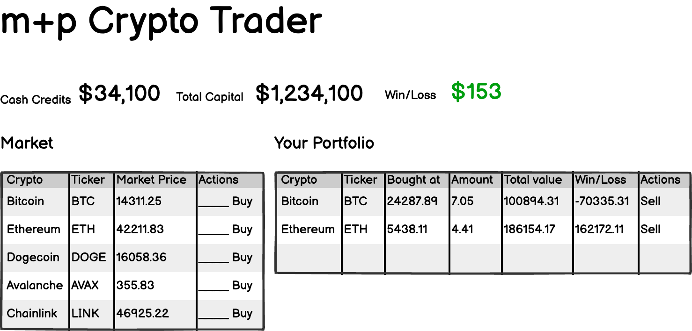

# m+p AI Coding Workshop Playbook

## Teaser

```plaintext
Create a game of Tic Tac Toe in the browser.
```


## Prompt for Step 1:

Use the [initial_instructions.md](initial_instructions.md) + the image 


  
## Store the portfolio of the user in the localStorage

```plaintext
Store the portfolio of the user in the localStorage to preserve the state
across page reloads.
```

## Use an API to fetch the data 
Provide the .env file with the content from https://pwpush.muehlemann-popp.ch/en/p/of-ohtel1ck


Prompt:
```plaintext
So far, the currenty valuation were mocked. I want you now to use the Coinapi API described at 
@https://docs.coinapi.io/market-data/rest-api/exchange-rates/get-all-current-rates  to fetch all the rates every 10 seconds.
The API Key is already provided in the .env file.
```


## Add account balance reporting system

Prepare the Postgres MCP server.

Use the config snippet from https://pwpush.muehlemann-popp.ch/en/p/qsjyukai6v19

```plaintext
Implement a real-time account balance reporting system for the virtual-crypto-trader application that connects to a central PostgreSQL database. Your implementation should:

- Use the MCP postgres-cryptotrader server to query the database structure and understand the schema
- Generate a Prisma schema file in the project that matches the existing database structure
- Create a database utility module that uses Prisma to connect to the PostgreSQL database
- The Postgres DSN can be found in the .env file
- Implement a server-side API route in Next.js that handles database operations (since Prisma can't run in the browser)
- Modify the trading context to report the user's total account balance (cash + portfolio value) to the database every 10 seconds every time the user makes a trade OR the crypto prices change.
- While writing the code, ask the user for his username and hardcode it in the code. Do not use the username dialog component.
- Ensure proper error handling and logging for database operations
- DO NOT modify the existing database schema or the existing database data
```

## Add the memory bank

[Link to the custom instructions](https://github.com/nickbaumann98/cline_docs/blob/main/prompting/custom%20instructions%20library/cline-memory-bank.md)

